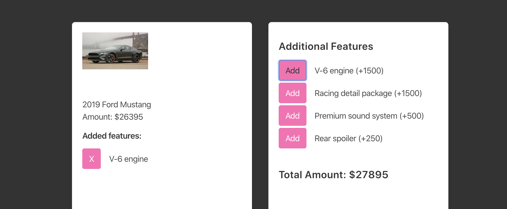

# Redux - Car Sales

In this project I will implement Redux to manage the state for this React application.

- Move the given state to the reducer as the initial state for the Redux store.
- Set up the Redux flow
- User should be able to add features to their car
- User should be able to remove added features from their car
- Total should update as user adds and removes features from their car
